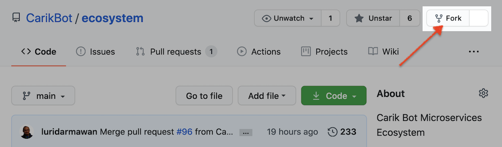

# Ikut Berkontribusi

Anda berminat untuk berkontribusi di **Carik Microservice Ecosystem** ini? Boleh kok, dengan senang hati. 

Caranya cukup mudah:

1. [*Fork*](https://github.com/CarikBot/ecosystem/network/members) repositori ini. 
2. Buatlah branch baru yang merupakan turunan dari branch **development**.
3. Buat [MindFlow](docs/mindmap-structure.md) yang anda ingikan.
4. Eksport dokumen MindFlow ke format **Freemind** (.mm).
5. _Commit, push_ dan ajukan _pull request_.

Fitur akan segera dipublish setelah Carik review.

## Tidak bisa pakai Github

Anda tidak bisa mengoperasikan github? Jangan khawatir, kirimkan saja dokumen MindFlow-nya kepada kami. Selanjutny para Carik akan segera bantu.

## Donasi

Kami membuka jalur donasi untuk pengembangan ekosistem ini.

