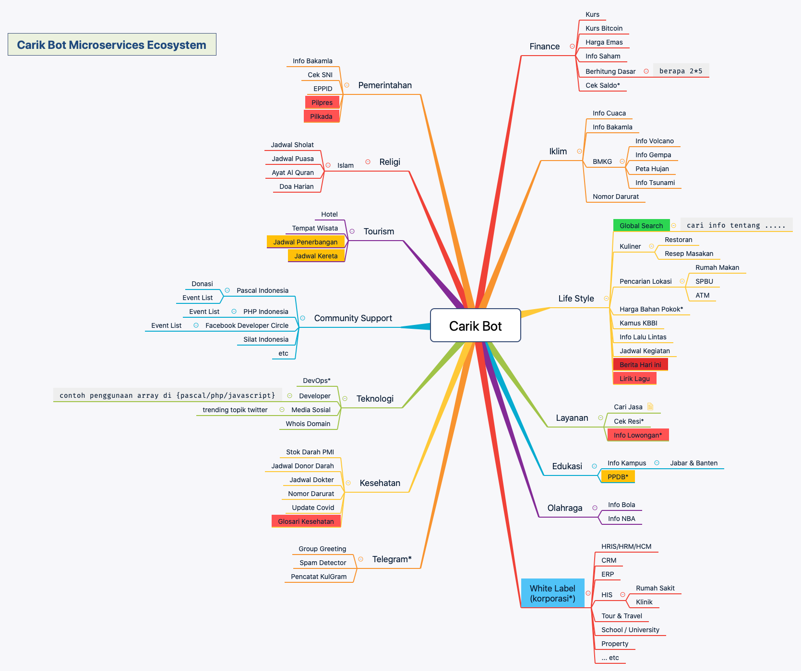
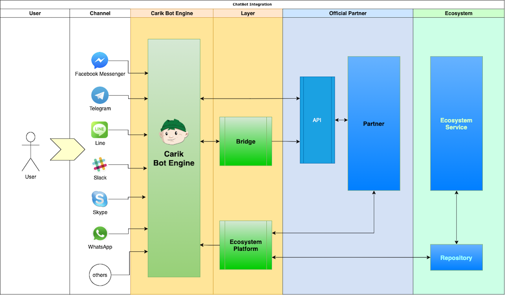

# Carik Bot Microservices Ecosystem

**Carik Bot Microservices Ecosystem** adalah suatu sistem yang berisi kumpulan _microservice_ yang menjadi pendukung dari layanan _chatbot_ [Carik](https://carik.id).

Ilustrasi ini menggambarkan _service-service_ yang terhubung di dalam **Platform Carik Bot**, masing-masing terhubung dalam baik untuk mode _conversational_ maupun _menu-based_.
 

Platform Carik Bot memberikan kesempatan kepada para developer untuk menghubungkan layanan-nya ke dalam ChatBot, khususnya untuk _menu-based chatbot_. Sangat mudah, bahkan nyaris **tanpa _coding_**. Cukup dengan membuat desain dan struktur _mind flow_-nya dengan aplikasi _mind mapper_, selanjutnya biarkan Carik yang bekerja.

Silakan berkontribusi di dalam repositori ini, di branch development, selanjutnya Carik akan segera melakukan distribusi secara otomatis setelah melalui approval.

## Alur Kerja

**Chatbot** yang menggunakan [Carik Engine](https://carik.id) dalam menjalankan sistemnya mempunyai alur seperti ilustrasi di bawah ini.

//TODO: deskripsi

## Desain

Bagaimana cara mendesain **Mind Flow** dari ekosistem ini? Dan apa itu *Mind Flow*? **Mind Flow** di Carik adalah suatu alur interaksi antar pengguna dengan chatbot, khususnya dalam mode _menu-based_ .

Ada beberapa cara dalam membuat _Mind Flow_ ini:

1. Membuat data berformat .json
2. Menggambar desain melalui aplikasi _mind mapper_ seperti XMind atau Freemind.

...
..
.
