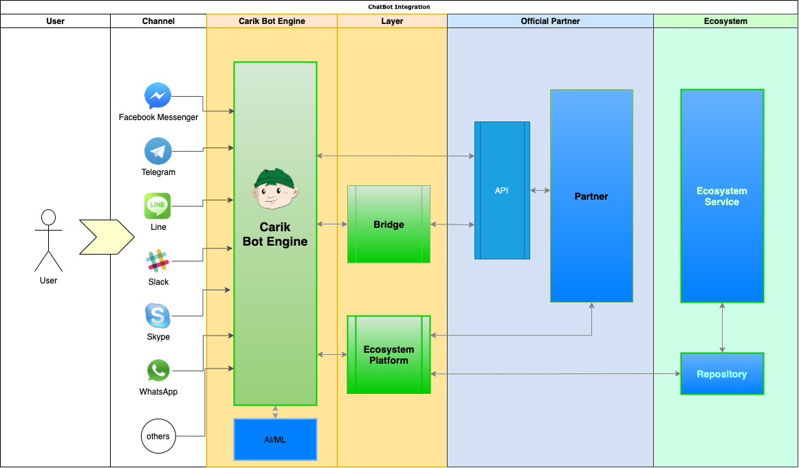

# Carik Bot Microservices Ecosystem

**Carik Bot Microservices Ecosystem** adalah suatu sistem yang berisi kumpulan _microservice_ yang menjadi pendukung dari layanan _chatbot_ [Carik](https://carik.id).

Ilustrasi ini menggambarkan _service-service_ yang terhubung di dalam **Platform Carik Bot**, masing-masing terhubung dalam baik untuk mode _conversational_ maupun _menu-based_.
 

Platform Carik Bot memberikan kesempatan kepada para developer untuk menghubungkan layanan-nya ke dalam ChatBot, khususnya untuk _menu-based chatbot_. Sangat mudah, bahkan nyaris **tanpa _coding_**. Cukup dengan membuat desain dan struktur _mind flow_-nya dengan aplikasi _mind mapper_, selanjutnya biarkan Carik yang bekerja.

## Alur Kerja

**Chatbot** yang menggunakan [Carik Engine](https://carik.id) dalam menjalankan sistemnya mempunyai alur seperti ilustrasi di bawah ini.

//TODO: deskripsi

## Desain Mind Flow

Bagaimana cara mendesain **[Mind Flow](docs/mindmap-structure.md)** dari ekosistem ini? Dan apa itu *Mind Flow*? **[Mind Flow](docs/mindmap-structure.md)** di Carik adalah suatu alur interaksi antar pengguna dengan chatbot, khususnya dalam mode _menu-based_ .

Ada beberapa cara dalam membuat _Mind Flow_ ini:

1. Membuat data berformat .json.
2. Menggambar desain melalui aplikasi _mind mapper_ seperti [XMind](https://www.xmind.net/) atau [Freemind](https://sourceforge.net/projects/freemind/). Disarankan untuk menggunakan Freemind atau aplikasi yang bisa _export_ ke format Freemind.

Untuk informasi selengkapnya bisa pelajari panduan tentang struktur file .json dan [struktur file mindmapper](docs/mindmap-structure.md) ini.

## API (Application Programming Interface)

Jika Anda akan menghubungkan **ecosystem** dengan data atau layanan pihak ketiga, anda perlu membuat **API** _(Application Programming Interface)_ sebagai jembatan penghubungnya. API bisa bebas dibuat dengan bahasa atau teknologi apapun, yang penting menghasilkan _output_ yang sesuai dengan format yang dibutuhkan oleh platform ini.

Untuk informasi selengkapnya bisa pelajari panduan tentang [struktur API](docs/api-structure.md) di platform ini.

## Deployment

**Ecosystem Deployment** dilakukan secara otomatis oleh platform setelah melalui approval.

## Kontribusi

Silakan [berkontribusi](CONTRIBUTING.md) di dalam repositori ini, di branch development, selanjutnya Carik akan segera melakukan distribusi secara otomatis setelah melalui approval. Anda bisa pelajari dari [paket-paket microservice](docs/package-list.md) yang sudah ada di repositori ini.

Jika menemukan bug atau ada ide yang menarik, anda bisa [sampaikan kepada kami](https://github.com/CarikBot/ecosystem/issues/new/choose).

***

### Definisi 

Beberapa pengertian terhadap kata yang disampaikan berulang di dokumen ini:

- **Ecosystem**, maksudnya adalah **[Carik Bot Microservices Ecosystem](https://github.com/CarikBot/ecosystem)**, yaitu kumpulan microservice yang menjadi pendukung dari layanan chatbot Carik.
- **Platform**, yaitu salah satu sistem di dalam Carik Bot yang berfungsi untuk mendistribusikan ecosystem.
- **Engine**, yaitu _bot engine_ yang dikembangkan oleh Carik dan digunakan oleh [Carik Bot](https://carik.id) sendiri ataupun chatbot lain.
- **Mind Flow**, adalah alur interaksi antar pengguna dengan chatbot, khususnya dalam mode menu-based. Desain Mind Flow bisa dilakukan dengan menggunakan aplikasi mind mapper.

***

**Catatan:**
Sebagian kode sumber _microservice_ yang ada saat ini, dan yang berlisensi terbuka, akan mulai didistribusikan ke repositori ini.

# Donation

Kami menerima donasi. Donasi akan digunakan untuk pengembangan dan memastikan layanan [Carik Bot](https://carik.id) dan [Carik Ecosystem](https://github.com/CarikBot/ecosystem/) tetap berjalan.

Pemberian donasi bisa dilakukan melalui chat langsung ke Carik Bot di: 

 - [Telegram](https://t.me/carikBot?start=donasi)
 - [Facebook Messenger](https://m.me/Carik.Bot?ref=donasi)
 - [Whatsapp](https://wa.me/6287887100878?text=donasi)
 - [Line](https://line.me/ti/p/~@carik)
 - [Instagram](https://www.instagram.com/carikbot/)

dengan mengirim isi pesan `donasi`.

# Credits

Carik Bot is developed by [Luri Darmawan](https://github.com/luridarmawan/) and 20+ amazing contributors. Special thanks to Hastura, Mbah Don and Delli for originally creating Carik character.

# Premium Support

[Carik Bot](https://carik.id), as an open source project, is free to use and always will be. [Cakti](https://cakti.id/) offers premium Chat Bot app design/development services. Email us at [support@carik.id](mailto:support@carik.id) to get in touch for more details.

