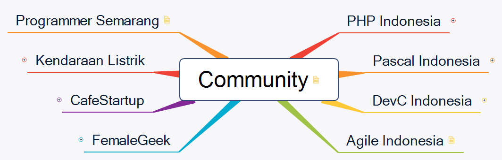

## Community Support
`category: community`

`keyword: info komunitas`

### PHP Indonesia

Komunitas PHP Indonesia

| Fitur | Keyword |
|---|---|
| Daftar Event | `jadwal event phpid` |
| Ajari Koding | `ajari koding [keyword]` |
| Online Learning | `phpid learning [keyword]` |
| Media Social | Media sosial PHP Indonesia |

### Pascal Indonesia

[Komunitas Pascal Indonesia](https://pascal-id.org).

| Fitur | Keyword |
|---|---|
| Materi Dasar Pascal | `materi pascal` |
| Donasi | `info donasi pascalid` Info donasi Pascal Indonesia |
| Media Sosial | Media sosial Pascal Indonesia |

### Agile Indonesia

Informasi tentang Agile Manifesto di group [Agile Indonesia](https://t.me/agileindonesia).

| Fitur | Keyword |
|---|---|
| Agile Manifesto | `agile manifesto` |
| Principles of Agile | `principles of agile` |
| Signatories of The Agile | `signatories of the agile` |
| About Agile Manifesto | `about agile manifesto` |
| About Agile Indonesia | `agile indonesia` |

### FemaleGeek

### DevC Indonesia

### Cafe Startup

| Fitur | Keyword |
|---|---|
| Daftar Startup |`daftar startup di cafestartup`  Menampilkan daftar startup yang tergabung di group CafeStartup. |

### Kendaraan Listrik

_move to [Automotive](https://github.com/CarikBot/ecosystem/tree/main/data/automotive/Automotive)_

| Fitur | Keyword |
|---|---|
| Jadwal Event |`jadwal event kendaraan listrik`  Menampilkan jadwal event Kendaraan Listrik Indonesia.|

