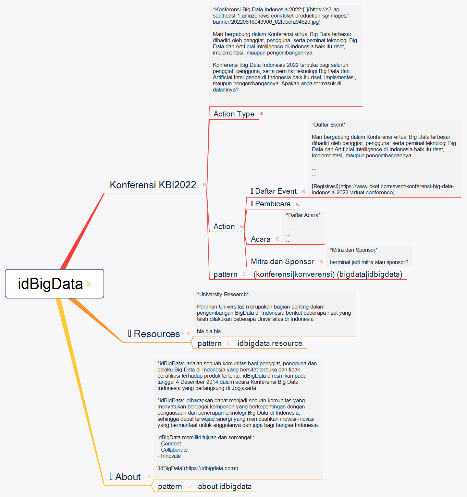

## idBigData
`category: community`

idBigData adalah sebuah komunitas bagi penggiat, pengguna dan pelaku Big Data di Indonesia yang bersifat terbuka dan tidak berafiliasi terhadap produk tertentu. idBigData diresmikan pada tanggal 4 Desember 2014 dalam acara Konferensi Big Data Indonesia yang berlangsung di Jogjakarta.

idBigData diharapkan dapat menjadi sebuah komunitas yang menyatukan berbagai komponen yang berkepentingan dengan penguasaan dan penerapan teknologi Big Data di Indonesia, sehingga dapat terwujud sinergi yang membuahkan inovasi-inovasi yang bermanfaat untuk anggotanya dan juga bagi bangsa Indonesia.

idBigData memiliki tujuan dan semangat :
- Connect
- Collaborate
- Innovate

https://idbigdata.com/

