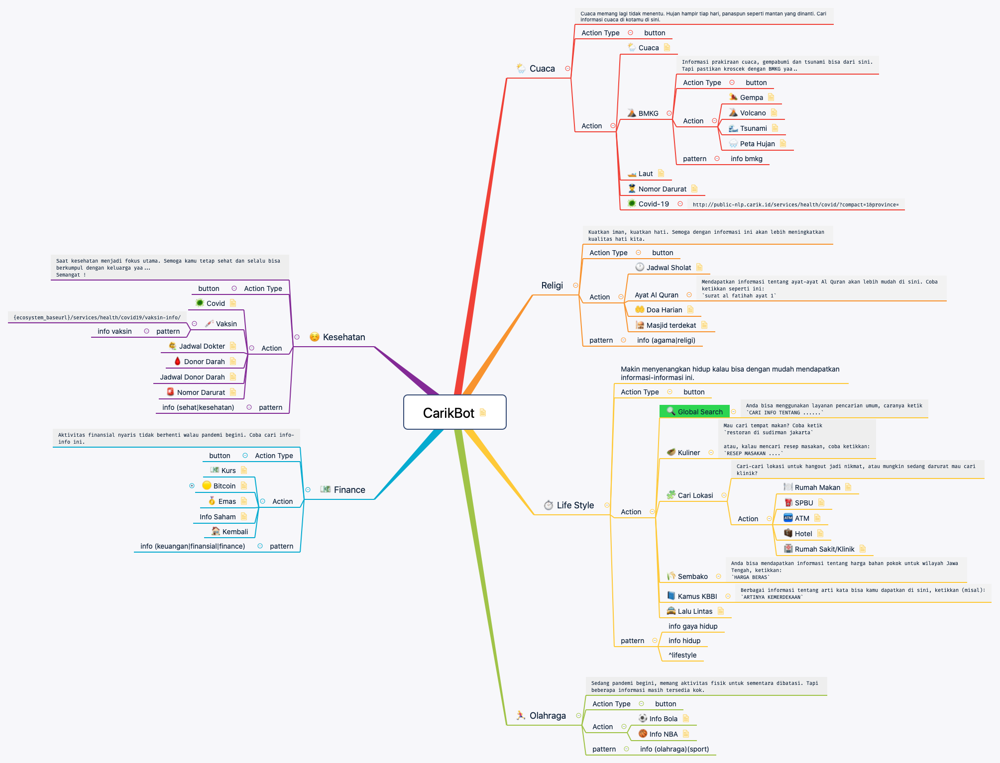

## Menu Utama Carik Bot
`category: main`

Ini adalah MindFlow dari menu utama [Carik Bot](https://carik.id)

Dari dokumen mindflow ini akan bisa dipelajari bagaimana membuat submenu, penggunaan pattern dan juga interaksi dengan API integrasi eksternal.

Fitur ini bisa diakses langsung ke [Carik Chat Assistant](https://carik.id) di beberapa channel pesan instan.

- [Carik Bot di Telegram](https://t.me/carikBot?start=menu)
- [Facebook Messenger](https://m.me/Carik.Bot?ref=menu)
- [Line](https://line.me/ti/p/~@carik)
- [Whatsapp](#)

Sosial media Carik bisa dijumpai di:

- [Facebook Page Carik](https://web.facebook.com/carik.bot/)
- [Instagram](https://www.instagram.com/carikbot/)

