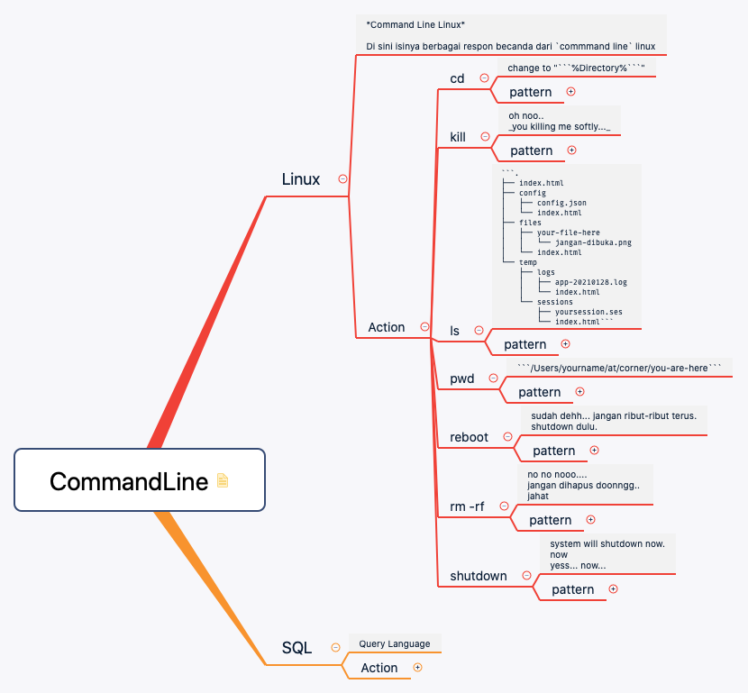

## Funny Command Line Response
`category: other`

Fitur untuk merespon perintah-perintah `command line` yang dimasukkan pengguna.

| command | deskripsi |
|---|---|
| cd | change directory |
| kill | kill process |
| ls | list file/directory |
| pwd | get current directory |
| reboot | reboot machine |
| rm -rf | delete files|
| shutdown | shutdown system |

