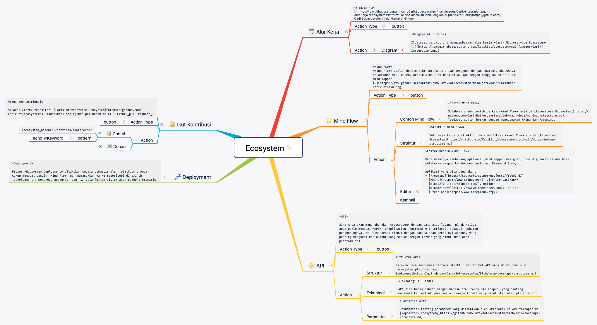

## Ecosystem
`category: other`

Ini adalah MindFlow dari menu ekosistem di [Carik Bot](https://carik.id)

Dari dokumen mindflow ini akan bisa dipelajari bagaimana membuat submenu, penggunaan pattern dan juga interaksi dengan API integrasi eksternal. Disertai pula dengan contoh sourcenya.

Fitur ini bisa diakses langsung ke [Carik Chat Assistant](https://carik.id) di beberapa channel pesan instan.

- [Carik Bot di Telegram](https://t.me/carikBot?start=ekosistem)
- [Facebook Messenger](https://m.me/Carik.Bot?ref=ekosistem)
- [Line](https://line.me/ti/p/~@carik)
- [Whatsapp](#)

