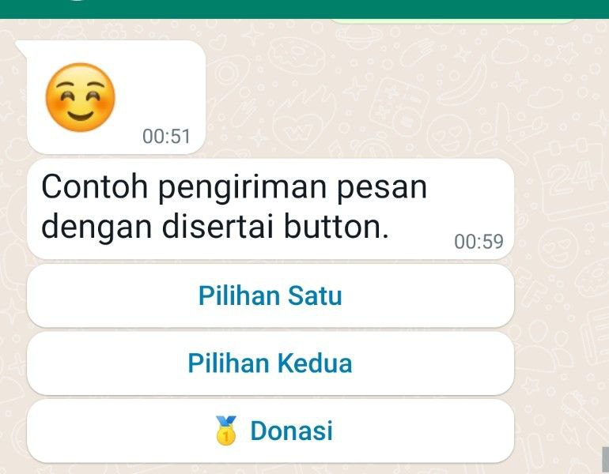

## Struktur API untuk Push Message

Fitur ini bermanfaat untuk mengirimkan pesan satu arah kepada pengguna.
Setiap permintaan pengiriman pesan harus memasukkan informasi token ke dalam header.

### Simple Push Message

Format standar request API yang diharapan:

```json
{
  "request": {
    "platform": "whatsapp",
    "user_id": "62....",
    "text": ""
  }
}
```

Dengan ketentuan:

| variabel | Deskripsi |
|---|---|
| user_id | phone number dalam format internasional, misal: 6281234567890 |
| text | konten teks yang akan dikirimkan kepada pengguna. |

Contoh pengiriman dengan perintah curl:

```bash
curl "{{baseurl}}/send-message/" \
  -H "content-type: application/json" \
  -H "token: {{Token}}" \
  -d '{"request":{
    "platform": "whatsapp",
    "user_id": "6287876469000",
    "text": "empat {{$timestamp}}"
  }}'
```

### Rich Content Push Message

#### Button

```json
{
  "request":{
    "platform": "whatsapp",
    "user_id": "628.....",
    "text": "Contoh pengiriman pesan dengan disertai button.",
    "action": {         
      "type": "button",
      "data": [
        [
          {
            "text": "Pilihan Satu",
          },
          {
            "text": "Pilihan Kedua",
          }
        ],
        [
          {
            "text": "🥇 Donasi",
          }
        ]
      ]
    }
  }
}
```


Dengan ketentuan:

Informasi tombol yang akan dibuat diletakkan pada variable `request/action/data`.

Khusus untuk whatsapp, hanya mendukung maksimal 3 (tiga buah) tombol. Konten yang terdapat lebih dari 3 tombol akan otomatis dikonversi dalam format menu teks.




