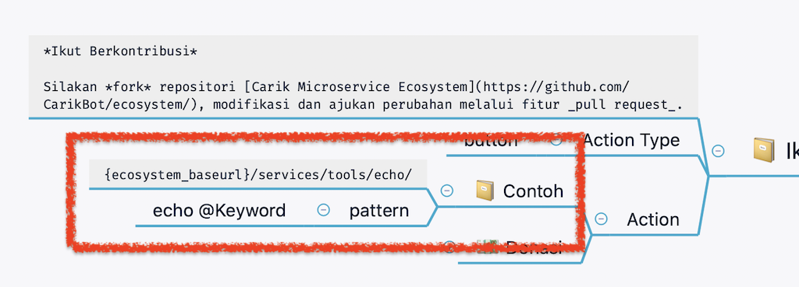
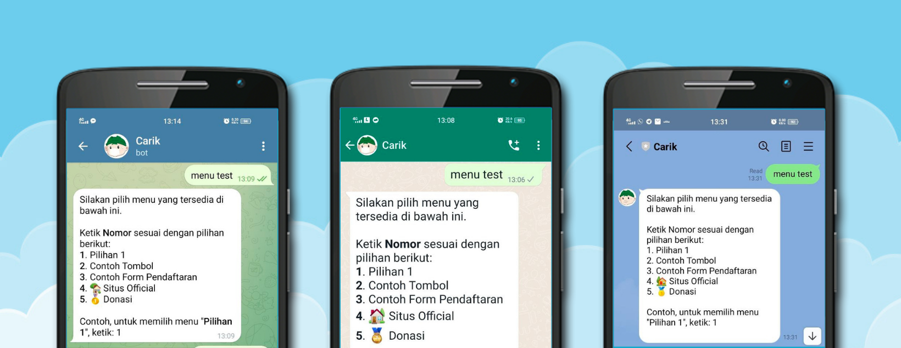
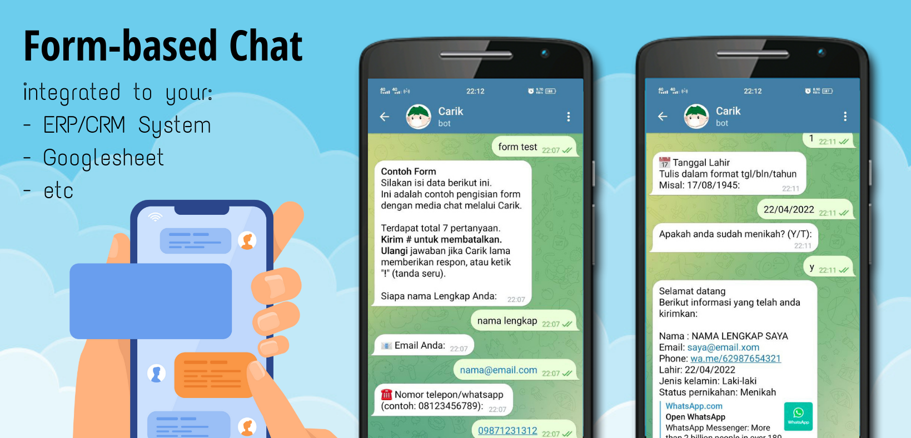

### Struktur API

Jika Anda akan menghubungkan **ecosystem** dengan data atau layanan pihak ketiga, anda perlu membuat **API** _(Application Programming Interface)_ sebagai jembatan penghubungnya. API bisa bebas dibuat dengan bahasa atau teknologi apapun, yang penting menghasilkan **output** yang sesuai dengan format yang dibutuhkan oleh platform ini. Transmisi informasi dari **platform** dikirimkan dalam method **POST**.

Format standar output API yang diharapan:

```json
{
  "code": 0,
  "text": "Text yang akan ditampilkan"
}
```

Dengan ketentuan:

| variabel | Deskripsi |
|---|---|
| code | error code.<br>0: sukses |
| text | konten yang akan dikirimkan kepada pengguna. |


## Parameter yang dilewatkan ke API

Tentunya anda ingin mendapatkan informasi siapa yang mengirimkan pesan untuk tujuan personalisasi data. Nah, dari API yang anda kembangkan, anda bisa mendapatkan beberapa informasi dari parameter ini.

| Parameter | Deskripsi |
|---|---|
| user_id | User ID pengguna.<br>format: "channel_code-original_user_id" |
| chat_id | (opsional) Jika [chatbot](t.me/carikBot) digunakan di dalam group, ChatID ini berisi id dari group tersebut. |
| channel_id | Channel aplikasi yang digunakan, yaitu: telegram, facebook, line, whatsapp, dan sebagainya. |
| full_name | Nama pengguna. |
| original_text | Isi pesan asli yang dikirimkan oleh pengguna kepada [chatbot](t.me/carikBot) sebelum dilakukan pemetaan oleh NLP [Carik](t.me/carikBot).  |

### Contoh Payload

```json
{
  "data": {
    "user_id": "5-6281234567890",
    "channel_id": "whatsapp",
    "full_name": "Luri Darmawan",
    "original_text": "jadwal dokter hari ini"
  }
}
```

## Contoh: API Echo

Contoh source sederhana bisa anda lihat dari [**API ECHO**](../source/services/tools/echo), yang memiliki fungsi mengembalikan respon sesuai kata/kalimat yang diketikkan oleh user.

**MindFlow** dari fitur ini bisa anda dari dokumen [mindmap](../data/other/Ecosystem/).




Dari ilustrasi di atas ini akan terbaca: terdapat pilihan menu "Contoh". Dan jika pengguna menuliskan kalimat `echo apapun teksnya`, platform akan mengirimkan informasi dan [parameter](#parameter-yang-dilewatkan-ke-api) ini ke api di url `{ecosystem_baseurl}/services/tools/echo/`.

`{ecosystem_baseurl}` ini maksudnya adalah url dari platform ekosistem Carik ini, isi variabelnya akan generic sesuai load server saat itu.

URL di atas hanya bersifat contoh saja. Jika anda memiliki api eksternal sendiri, silakan disesuaikan, misal: `https://api.yourdomain.tld/endpoint/path/path`.


## Action Response

[Carik Bot](https://carik.id) mempunyai fitur untuk bisa memberikan jawaban yang bersifat **rich content**, seperti bentuk menu, tombol, bahkan dalam bentuk form/essay.

Struktur API-nya merupakan pengembangan dari struktur api default di atas. Hanya perlu menambahkan beberapa tag informasi saja, khususnya menambahkan tag `type` dengan nilai `action`.

```json
  {
    "code": 0,
    "text": "Kalimat yang akan ditampilkan ke pengguna.",
    "type": "action",
    "action": {
      "type": "[action_type]",
      "url": "webhook_hanya_untuk_action_form",
      "suffix": "[optional]",
      "data": [
      ]
    }
  }
```

Dan keterangan dari isi tag action adalah:

| Parameter | Deskripsi |
|---|---|
| type | Tipe action yang akan dibuat, pilihannya: menu, buttton, form |
| url | (opsional) Jika tipe action-nya adalah form, url ini merupakan endpoint webhook yang akan diakses ketika isian form selesai dilakukan. |
| suffix | (opsional) Kalimat yang akan dicantumkan dibawah/setelah daftar menu.<br>Tulisan default: *"Contoh, untuk memilih menu "[menu]", ketik: 1"* |
| data | Isi data dari masing-masing action, dengan struktur tertentu. |

### Menu



Salah satu yang paling sering digunakan dalam chatbot adalah adanya fitur menu, di mana user diminta untuk memilih salah satu menu yang tersedia.

Data ini memiliki 2 level. Hal ini untuk mengakomodir kompatibilitas antar platform. Setiap baris sebaiknya cukup memiliki maksimal 4 menu saja.

Tiap item menu memiliki konfigurasi sebagai berikut:

```json
  {
    "text": "Judul Menu",
    "callback_data": "text=echo pilih saya"
  },

```

| Parameter | Deskripsi |
|---|---|
| text | Judul dari menu tersebut. |
| callback_data | Berupa *parametered value*. Yang artinya, jika menu tersebut dipilih, seolah-olah pengguna mengirimkan teks tersebut ke sistem chatbot.<br>Untuk contoh di atas, chatbot akan menerima perintah `echo pilih saya`.  |

Contoh lengkap struktur json bisa kamu lihat dari [contoh file json menu ini](./ex-action-menu.json).

Anda bisa mencoba contoh menu ini melalu Carik dengan keyword: `MENU TEST`.


### Tombol


Pada beberapa platform pesan instan memberikan kemudahan dalam mengakses pilihan pesan dalam bentuk tombol/button. Pengguna tidak perlu menuliskan angka-angka menu, tetapi cukup dengan memilih tombol yang tersedia. Anda tidak perlu risau bagimana jika platform yang anda gunakan tidak mendukung adanya tombol. Jangan khawatir, karena platform [Carik Ecosystem](https://carik.id) akan otomatis mengubahnya menjadi format yang didukung, defaultnya akan berbentu `menu`.

Untuk catatan lagi, tiap platform pesan instan mempunyai kebijakan berbeda dalam penggunaan tombol, khususnya jumlah tombol yang diperbolehkan. Carik menyarankan cukup maksimal 4 tombol dalam setiap pesan, agar kompatibel di semua platform.

Selain mengubah isi tag `action` menjadi `button`, selebihnya sama dengan dengan stuktur menu di atas.

```json
{
  "code": 0,
  "text": "Contoh penggunaan action button.",
  "type": "action",
  "action": {
    "type": "button",
    "button_title": "Tampilkan",
    "imageDefault": "https://carik.id/images/banner.jpg",
    "data": [
      [
        {
          "text": "Update Corona",
          "callback_data": "text=update corona"
        }


      ]
    ]
  }
}
```

| Parameter | Deskripsi |
|---|---|
| text | Judul dari menu tersebut. |
| callback_data | Berupa parametered value. Yang artinya, jika menu tersebut dipilih, seolah-olah pengguna mengirimkan teks tersebut ke sistem chatbot.<br>Untuk contoh di atas, chatbot akan menerima perintah `echo pilih saya`.  |
| url | Opsional. Tombol akan berfungsi sebagai **link** menuju tautan tertentu.<br>`callback_data` tidak aktif jika tag `url` ini diisi. |
| size | Ukuran tinggi browser saat tautan diakses.<br>*Hanya untuk facebook messenger.*
| button_title | Opsional. Teks default jika platform mempunyai fitur **grouping button** |
| imageDefault | Opsional. Tautan Gambar jika platform mempunyai fitur untuk menampilkan gambar default |


Contoh lengkap struktur json bisa kamu lihat dari [contoh file json tombol ini](./ex-action-button.json).

Anda bisa mencoba contoh menu ini melalu Carik dengan keyword: `BUTTON TEST`.

## Form



Fitur ini bermanfaat jika Anda membutuhkan chatbot yang berfungsi untuk mendapatkan input dari pengguna secara berturutan, misal seperti form pendaftaran, form feedback, survey, kuesioner, soal ujian dan sebagainya.

Sama seperti **action** menu dan tombol di atas, struktur json form juga sama, hanya mengubah isi tag `type` menjadi `form` saja.

```json
{
  "code": 0,
  "text": "Hi .\nIni adalah contoh/template untuk membuat form.",
  "type": "action",
  "action": {
    "type": "form",
    "name": "Form Test",
    "url": "your_endpoint_url",
    "data": [
      [
        {
          "title": "Nama Lengkap",
          "name": "fullName",
          "type": "string"
        },
        {
          "title": "#Jenis Kelamin",
          "name": "jenisKelamin",
          "type": "option",
          "options": [
            "Laki-laki",
            "perempuan"
          ]
        }


      ]
    ]
  }
}
```

| Parameter | Deskripsi |
|---|---|
| name | Nama Form |
| url | **url endpoint** dari API/webhook yang akan menerima hit saat form selesai diisi.<br>Ketentuan dan parameter yang akan dilempar ke endpoint ini bisa dilihat di bagian [*form handler*](#form-handler) di bawah. |


### Ketentuan

Ketentuan dalam pembuatan item data pertanyaan, setiap field harus memiliki parameter berikut:

| Parameter | Deskripsi |
|---|---|
| title | Teks dari pertanyaan |
| nama | Nama variabel untuk menyimpan jawaban |
| type | tipe data, berupa: *string*, *boolean*, *numeric*, *date* dan *option* |

Platform [Ecosystem Carik](https://github.com/CarikBot/ecosystem) akan secara otomatis melakukan **validasi** pada setiap jawaban dari pengguna.

Tipe `option` akan dipakai pada pertanyaan yang bersifat pilihan, misal: jenis kelamin atau soal-soal kuesioner. Datanya berbentuk larik seperti berikut:

```json
  "options": [
    "Laki-laki",
    "perempuan"
  ]
```

### Parameter Opsional

Parameter opsional yang bisa digunakan

| Parameter | Deskripsi |
|---|---|
| length_min | Panjang minimal untuk field yang bertipe `string` |
| length_max | Panjang maksimal untuk field yang bertipe`string` |
| value_min | Nilai minimal untuk field yang bertipe `numeric` |
| value_max | Nilai maksimal untuk field yang bertipe `numeric` |

Contoh penggunaan parameter ini:

```json
{


        {
          "title": "NIK (Nomor Induk Kependudukan)",
          "name": "nik",
          "type": "string",
          "length_min": 16
        },
        {
          "title": "Usia",
          "name": "usia",
          "type": "numeric",
          "value_min": 17
        },


}```


Contoh lengkap struktur json bisa kamu lihat dari [contoh file json form ini](./ex-action-form.json).

#### Form Handler

---

**Form Handler** ini berfungsi sebagai *service* yang akan mengolah jawaban dari pengguna. URL form handler akan diakses pada dua kemungkinan, saat form selesai diisi atau saat dibatalkan.

Parameter yang diterima oleh form handler berformat json dengan template seperti ini:

```json
{
  "post_date" : "2022-04-25 00:11:14",
  "user_id" : "[user_id]",
  "full_name" : "[full_name]",
  "session" : "[session_id]",
  "data" : {
    "var01": "[value01]",
    "var02": "[value02]",
    "var03": "[value03]",
    "var04_t": "[selected_option_title]",
    "var04": "[value04]",


    "submit" : "OK/CANCEL"
  }
}
```

| Submit Value | Deskripsi |
|---|---|
| OK | Form selesai diisi, dan variable `data` berisi hasil isian pengguna. |
| CANCEL | Form batal diisi atas permintaan pengguna. |

Contoh skrip untuk mengolah hasil isian form ini bisa dilihat dari [Skrip PHP](../source/services/tools/example/form.php) ini. Pada dasarnya kamu bebas membuat API ini dalam bahasa pemrograman apapun yang kamu suka.

Anda bisa mencoba hasil dari contoh form ini melalu Carik dengan keyword: `FORM TEST`.
