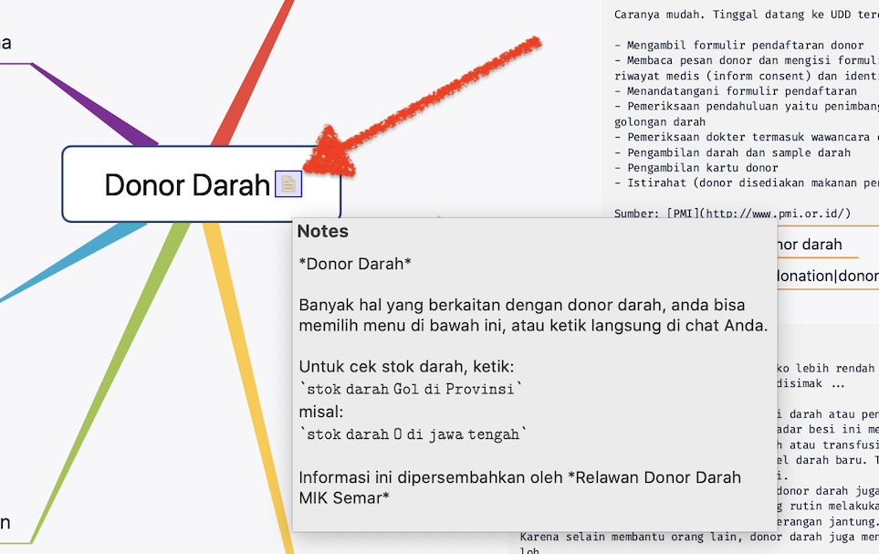
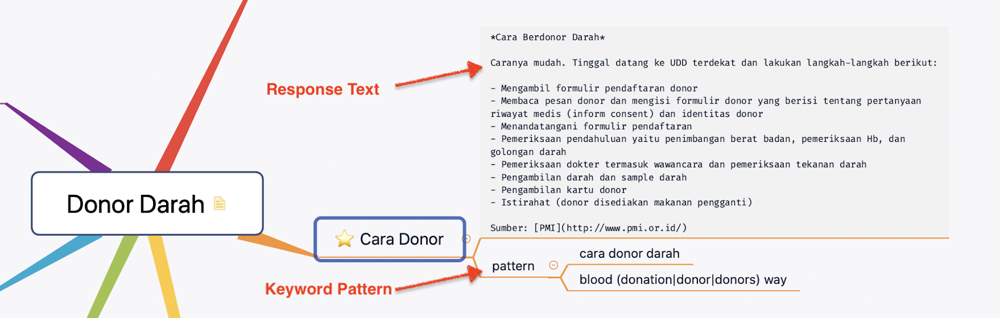
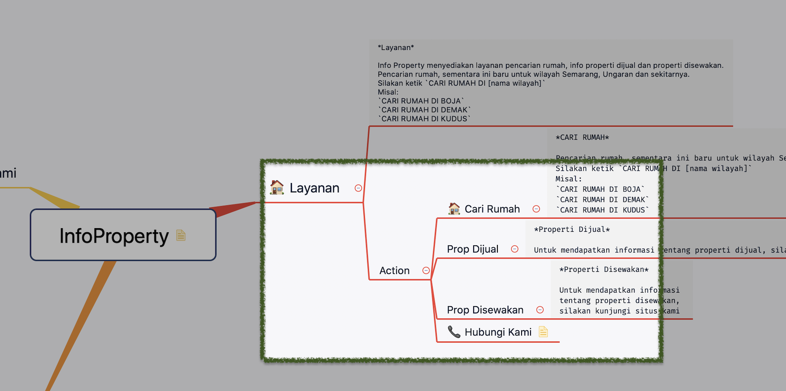
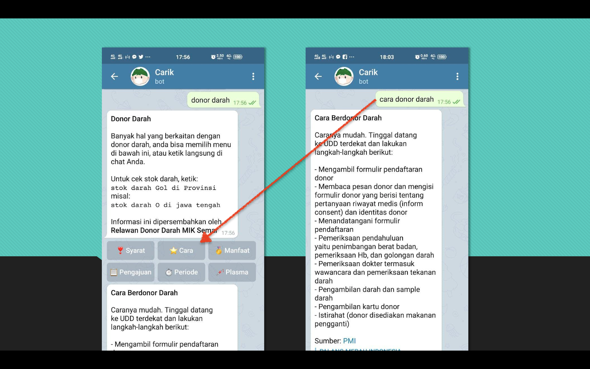

### Strukture Mind Flow di Carik Bot Engine


Pada dasarnya setiap layanan akan memiliki beberapa pilihan menu. Misal seperti di [Carik Bot](t.me/carikBot?start=help) yang memiliki menu awal seperti ilustrasi berikut.


Dan setiap menu akan memiliki anak/sub menu, sub-sub menu, dan seterusnya. Tidak ada batasan dalam jumlah sub-menu yang diperbolehkan, tapi tentu saja semakin dalam menu akan semakin membuat pengguna menjadi tidak antusias lagi.


Anda bisa mempelajari berkas-berkas pendukung ini:

1. [Berkas XMind CarikBot](https://github.com/CarikBot/ecosystem/raw/main/data/main/CarikBot/CarikBot.xmind).
2. [Berkas Freemind CarikBot](https://github.com/CarikBot/ecosystem/raw/main/data/main/CarikBot/CarikBot.mm).
3. [Berkas JSON CarikBot](https://github.com/CarikBot/ecosystem/raw/main/data/main/CarikBot/CarikBot.json).<br>Berkas .json ini akan dibuat otomatis dari berkas freemind yang _dipush_ ke repo ini.

Anda bisa memodifikasi contoh berkas [XMind](https://github.com/CarikBot/ecosystem/raw/main/data/main/CarikBot/CarikBot.xmind) ini untuk menambahkan fitur atau mungkin menambahkan integrasi layanan Anda ke dalam **[Ecosystem](https://github.com/CarikBot/ecosystem)** ini.


## Struktur File

Semua dokumen _MindFlow_ disimpan di dalam folder `data` yang terbagi lagi ke dalam kategori.

```bash
.
├── education
│   └── Pendidikan
│       ├── Pendidikan.mm
│       ├── Pendidikan.xmind
│       └── README.md
├── health
│   └── RDDMIKSemar
│       ├── RDDMIKSemar.mm
│       ├── RDDMIKSemar.xmind
│       └── README.md
├── other
│   └── Ecosystem
│       ├── Ecosystem.mm
│       ├── Ecosystem.png
│       └── Ecosystem.xmind
├── package.json
```

File [package.json](../data/package.json) merupakan daftar isi dari seluruh module yang anda.

## Struktur Mind Flow

Setiap dokumen _MindFlow_ menggambarkan suatu menu modul tertentu. Dan setiap node menu bisa memilki node sub-menu lagi di dalamnya.

### Menu Utama

Setiap menu memili auto respon berupa teks. Khusus untuk menu utama, teks respon ini bisa ditempatkan di dalam `note`.



### Sub Menu

Setiap menu bebas memiliki sub-menu, dan masing-masing sub-menu juga bisa memiliki sub-sub-menu lagi di dalamnya.



Teks pertama dari setiap node merupakan teks auto respon yang diberikan setiap kali pengguna memilih menu tersebut.

Setiap sub-menu dibuat harus di dalam node `Action`.



#### Pattern

Setiap menu/sub-menu juga bisa memiliki **pattern** tertentu. Pattern ini adalah pola kalimat/kata yang biasanya dilakukan oleh pengguna ketika melakukan percakapan. Pada contoh di atas, sub menu "Cari Donor" akan otomatis ditampilkan jika pengguna mengirimkan pesan bertulis `cara donor darah`.

Kira-kira bisa ditunjukkan seperti ini:




## Tools

Pada dasarnya sembarang aplikasi _mind mapper designer_ bisa digunakan selama bisa melakukan ekspor ke dokumen berformat Freemind (.mm).

Aplikasi _mind mapper designer_ yang bisa digunakan:

- [Freemind](https://sourceforge.net/projects/freemind/)
- [XMind](https://www.xmind.net/), direkomendasikan*
- [Mind42](https://mind42.com/), online
- [Mindmeister](https://www.mindmeister.com/), online
- [Freeplane](https://www.freeplane.org/)


