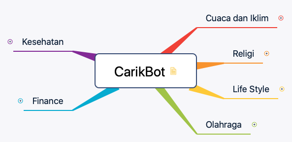
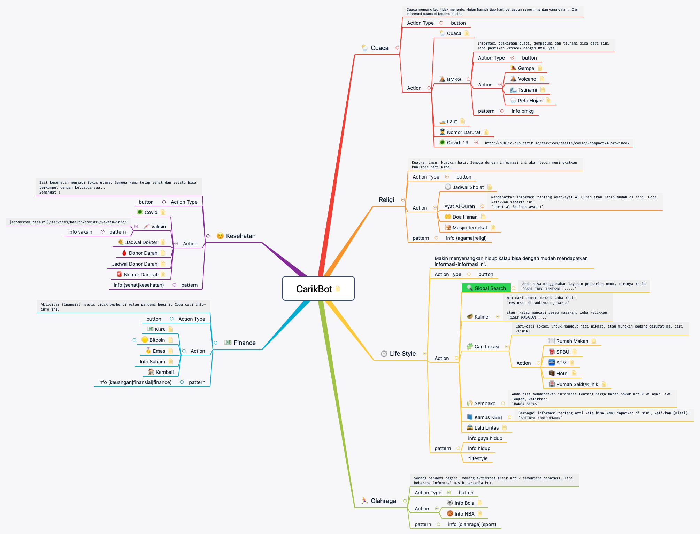

### Strukture Mind Flow di Carik Bot Engine

Pada dasarnya setiap layanan akan memiliki beberapa pilihan menu. Misal seperti di [Carik Bot](t.me/carikBot?start=help) yang memiliki menu awal seperti ilustrasi berikut.

Dan setiap menu akan memiliki anak/sub menu, sub-sub menu, dan seterusnya. Tidak ada batasan dalam jumlah sub-menu yang diperbolehkan, tapi tentu saja semakin dalam menu akan semakin membuat pengguna menjadi tidak antusias lagi.

Anda bisa mempelajari berkas-berkas pendukung ini:

1. [Berkas XMind CarikBot](https://github.com/CarikBot/ecosystem/raw/main/data/main/CarikBot/CarikBot.xmind).
2. [Berkas Freemind CarikBot](https://github.com/CarikBot/ecosystem/raw/main/data/main/CarikBot/CarikBot.mm).
3. [Berkas JSON CarikBot](https://github.com/CarikBot/ecosystem/raw/main/data/main/CarikBot/CarikBot.json). Berkas .json ini akan dibuat otomatis dari berkas freemind yang _dipush_ ke repo ini.

Anda bisa memodifikasi contoh berkas [XMind](https://github.com/CarikBot/ecosystem/raw/main/data/main/CarikBot/CarikBot.xmind) ini untuk menambahkan fitur atau mungkin menambahkan integrasi layanan Anda ke dalam **[Ecosystem](https://github.com/CarikBot/ecosystem)** ini.

## Struktur Mind Flow

//TODO: Detail struktur Mind Flow

### Tools

Pada dasarnya sembarang aplikasi _mind mapper designer_ bisa digunakan selama bisa melakukan ekspor ke dokumen berformat Freemind (.mm).

Aplikasi _mind mapper designer_ yang bisa digunakan:

- [Freemind](https://sourceforge.net/projects/freemind/)
- [XMind](https://www.xmind.net/), direkomendasikan*
- [Mind42](https://mind42.com/), online
- [Mindmeister](https://www.mindmeister.com/), online
- [Freeplane](https://www.freeplane.org/)

