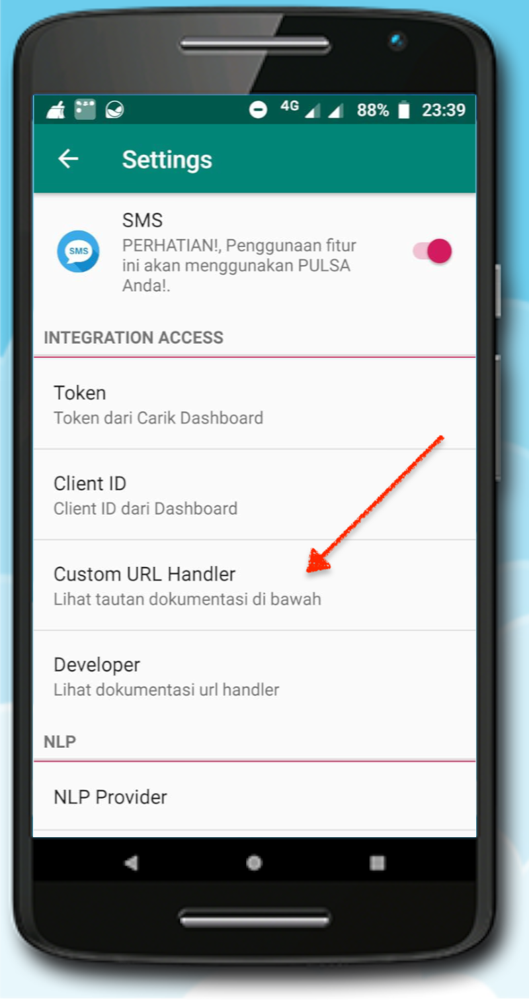
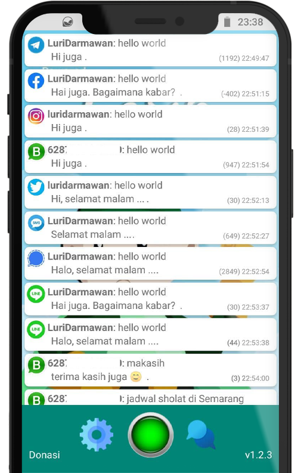

# Chat Handler untuk Carik oTTo


[**Carik oTTo**](https://carik.id/otto/) adalah solusi yang tepat untuk membuat _chat bot assistant_.
Hanya dengan menggunakan aplikasi mobile Android, Anda sudah bisa membuat _chat bot_ sendiri.

Dukungan terhadap berbagai platform media sosial akan semakin memudahkan Anda dalam menjawab pesan-pesan yang datang berulang.

Sistemnya yang sangat fleksibel memudahkan untuk dihubungkan dengan sistem internal Anda, misal untuk info produk, cek resi pengiriman, daftar hadir dan banyak hal lainnya. Dan yang penting lagi, terintegrasi dengan sarana pembayaran elektronik (QRIS, eWallet, Transfer).

## Integrasi

[**Carik oTTo**](https://carik.id/otto/) sangat mudah diintegrasikan dengan internal sistem Anda. Cukup dengan membuat API (_Application Programming Interface_) dan memasukkannya ke dalam konfigurasi aplikasi Carik oTTo di ponsel android Anda.



### Payload

Setiap ada pesan yang masuk, **oTTo** akan mengirimkan data __payload__ ke API dengan format seperti berikut:

```json
{
  "message": {
    "message_id": 0,
    "text": "halo",
    "chat": {
      "id": "chat-user-id"
    },
    "from": {
      "id": "chat-user-id",
      "name": "name"
    }
  }
}
```


### Response

Setiap API yang dilewatkan melalui **oTTo** diwajibkan memiliki output berformat json seperti berikut. Isi dari variable `text` adalah pesan yang akan dikirimkan sebagai balasan pesan dari partner Anda.

```json
{
  "code": 0,
  "response": {
    "text": [
      "Hi, selamat pagi ..."
    ]
  }
}
```



