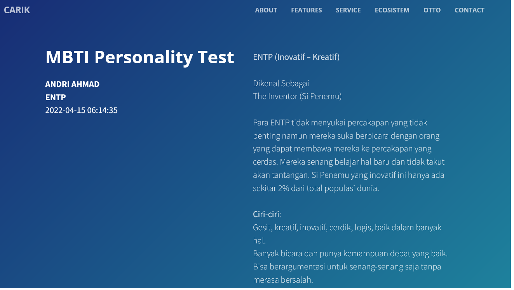

# Personality Test
`category: health`

Tes kepribadian adalah metode untuk menilai konstruksi kepribadian manusia. Kebanyakan instrumen penilaian kepribadian sebenarnya adalah langkah-langkah kuesioner laporan diri introspektif atau laporan dari catatan kehidupan seperti skala penilaian.

MBTI dan DISC adalah dua instrumen psikometrik yang memungkinkan prediksi dan evaluasi seseorang. Kedua tes ini digunakan di banyak organisasi dan institusi di seluruh dunia, dan bisa digunakan sebagai alat untuk memahami diri kita lebih dalam.

Data dan informasi dikutip dari berbagai sumber.

## Contoh Hasil Test

- MBTI: https://carik.id/personality-test/?id=68c0f6025d0ead18e7efc1d3407cb8e5949b6339
- DISC: https://carik.id/personality-test/?id=f3c2c7b0fb3762b31d9a17f4c31bbeb4370485ex

